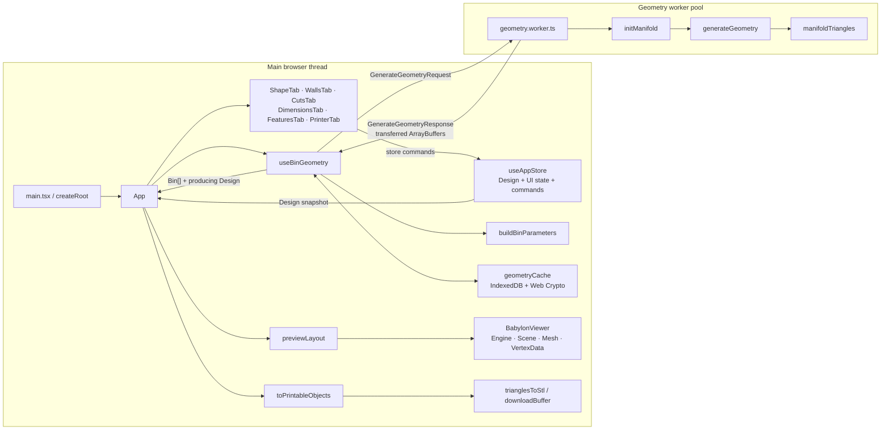
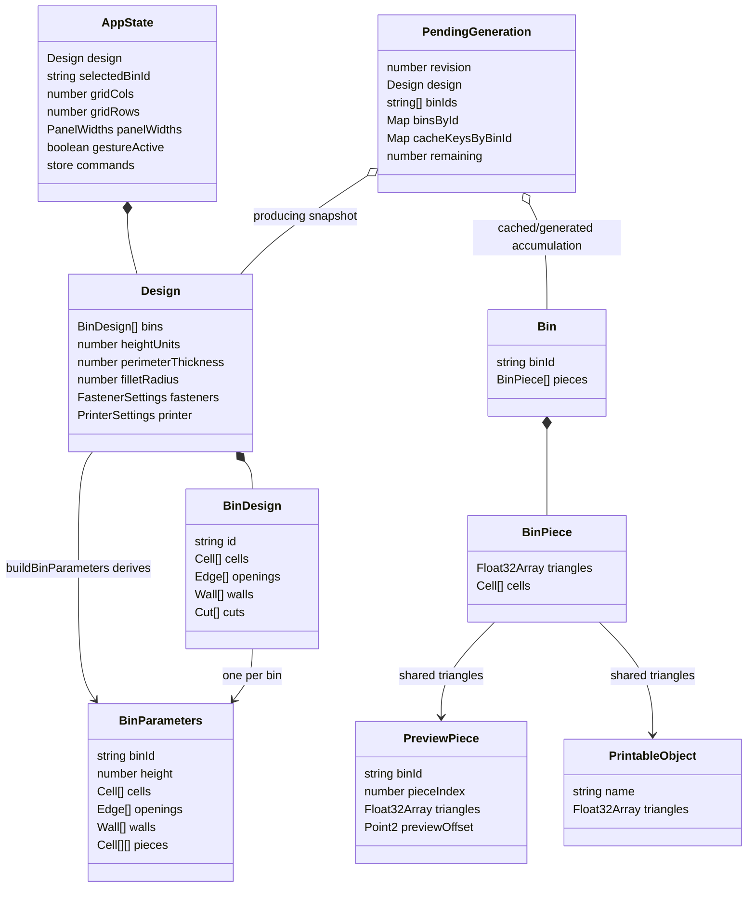

# Application Architecture

This guide explains how Gridfinity Expanded turns an edit in the browser into a 3D preview and printable STL files. It is the best starting point for a new contributor. The companion [object and method reference](./object-method-reference.md) is the exhaustive inventory of runtime symbols and objects.

The application does not define application-specific classes. Its own behavior is expressed as React function components, hooks, Zustand store commands, plain structured objects, and TypeScript functions. Class instances do exist at runtime, but they come from browser APIs, `manifold-3d`, Babylon.js, and React's renderer. This distinction matters at the worker boundary: application data is deliberately plain and structured-clone compatible, while library instances stay within the runtime that owns them.

Detailed geometry rules remain authoritative in [Gridfinity Geometry Pipeline](./geometry-pipeline.md). Babylon scene and camera mechanics remain authoritative in [Babylon Viewer](./babylon-viewer.md). This document describes how those subsystems fit into the complete application rather than repeating their algorithms.

## Terminology

- **Design**: editor-owned Zustand state. It contains logical bins and global dimensions, fasteners, and printer settings in row-down editor coordinates.
- **Logical bin (`BinDesign`)**: a stable id plus selected cells, perimeter openings, free-form walls, and editable cuts. Separate logical bins become separate complete physical bins.
- **Generation parameters (`BinParameters`)**: one trusted, self-contained, structured-clone-compatible geometry request for one logical bin. Spatial values have already been mirrored into generation coordinates.
- **Piece**: one connected cell footprint after stored cuts sever cell adjacencies. Piece array order supplies its stable zero-based piece index.
- **Generated bin (`Bin`)**: one logical bin id with its generated `BinPiece[]`. Each piece owns a global-coordinate `Float32Array` triangle soup and its generation-coordinate footprint.
- **Printable object (`PrintableObject`)**: one named triangle soup ready for STL serialization. It is derived from, but does not copy, a generated piece's triangle array.
- **Preview layout (`PreviewPiece`)**: a flattened generated piece plus a presentation-only XY offset. It shares the generated triangle array.
- **Revision**: a monotonically increasing hook-local number used to discard asynchronous cache results and worker replies for obsolete designs.

## System map



`main.tsx` creates the React root and wraps `App` in `StrictMode` and `MantineProvider`. `App` is the composition root: it reads design and panel state, invokes `useBinGeometry`, passes generated output to both `BabylonViewer` and `ExportMenu`, and lays out the editor panels. The viewer module is loaded through `React.lazy`; geometry generation and the rest of the editor do not wait for the Babylon chunk.

## Ownership and object relationships



The store owns the live `Design`; components never mutate it directly. Each command passed to Zustand's `set` creates replacement objects or arrays along the changed path. Unchanged bins and nested values may retain their references. Local interaction state—such as an in-progress wall, selected wall, paint mode, active tab, Babylon instances, workers, and generation bookkeeping—belongs to the component or hook that needs it and is not persisted in the store.

`buildBinParameters()` creates fresh per-bin objects and arrays. It partitions cells before mirroring so piece identity remains tied to editor order, then mirrors cells, openings, walls, and piece footprints across the complete design's occupied Y extent. The global fastener object is referenced directly inside each parameter object; it remains plain and is cloned by `postMessage` when sent to a worker.

## Edit to preview and export

```mermaid
sequenceDiagram
  actor User
  participant UI as Editor component
  participant Store as useAppStore
  participant Hook as useBinGeometry
  participant Params as buildBinParameters
  participant Cache as IndexedDB cache
  participant Worker as geometry.worker
  participant Geometry as generateGeometry
  participant Viewer as BabylonViewer
  participant Export as ExportMenu / STL

  User->>UI: change a cell, wall, cut, or setting
  UI->>Store: invoke explicit command
  Store-->>Hook: new Design snapshot
  Hook->>Hook: increment revision; cancel pending debounce
  Hook->>Params: derive BinParameters[]
  Params-->>Hook: mirrored, partitioned per-bin inputs
  Hook->>Cache: hash and read each bin in parallel
  Cache-->>Hook: hits and misses
  alt every bin is cached
    Hook->>Hook: restore design order and publish GeometryState
  else one or more misses
    loop each missing bin, round-robin over workers
      Hook->>Worker: postMessage({ revision, bins: [bin] })
      Worker->>Geometry: generateGeometry(wasm, bins)
      Geometry-->>Worker: Bin[] with Float32Array soups
      Worker-->>Hook: response + transferred triangle buffers
      Hook--)Cache: best-effort writeCachedBin
    end
    Hook->>Hook: merge hits/results in design order
  end
  Hook-->>Viewer: Bin[] + exact producing Design
  Viewer->>Viewer: previewLayout; replace meshes; fit camera
  User->>Export: choose one part or all parts
  Export->>Export: toPrintableObjects; trianglesToStl; downloadBuffer
```

Every design change increments the current revision, including changes made while a shape-paint gesture is held. A held gesture prevents new work from starting, so intermediate painted shapes invalidate older work without filling the worker queue. On release, the final design is generated. When workers are idle, work starts on the next timer turn; if a generation is already pending, changes are coalesced behind the hook's busy debounce.

Cache lookup is asynchronous. The hook checks the revision after all per-bin hash/read promises settle, so an obsolete lookup cannot publish or dispatch work. Worker responses must match both `revisionRef.current` and the current `PendingGeneration.revision`. Stale successes and failures are ignored. A current failure clears pending bookkeeping and publishes the generic geometry error while retaining the last successful bins.

The successful state deliberately pairs `Bin[]` with the exact `Design` snapshot that produced it. `previewLayout()` needs that snapshot to mirror the corresponding cuts and calculate piece spacing. Using the live, possibly newer store design would mix revisions.

## Zustand state and commands

`useAppStore` owns two kinds of state:

- Persistent design data: `design` and its bins, dimensions, fasteners, cuts, walls, and printer.
- Session UI data: selected bin id, editor grid dimensions, side-panel widths, and `gestureActive`.

Shape commands enforce editor behavior. `paintCell` moves a cell from an old owner if needed, starts a new logical bin when painting is not edge-connected to the selected bin, and calls `resetForShape` for every changed bin. `removeSelectedCell` does the same reset for removal and drops empty bins. A shape reset discards openings and walls and reseeds printer-required cuts because all three depend on the footprint.

Wall, opening, and cut commands update only the relevant design fields. `setPrinter` preserves existing cuts when all current pieces fit; otherwise it adds cuts until every obtainable part fits. Slider controls constrain their own inputs; notably `DimensionsTab` lowers the fillet radius when a new height would make it invalid. There is no second validation layer before geometry.

Store selectors in components subscribe to individual fields or commands. Zustand calls cause the selecting component to render when the selected reference or primitive changes. Derived collections in editors are either recalculated during render or memoized where they are large or used during pointer movement.

## IndexedDB cache

`geometryCache.ts` owns one lazily opened `IDBDatabase` promise per main-thread module lifetime. The `meshes` object store uses the cache hash as its key and has a `lastAccess` index. Records contain piece triangle arrays, footprint cells, an approximate byte size, and an access timestamp. They do not contain bin identity, editor state, STL bytes, normals, materials, or preview transforms.

`geometryCacheKey()` serializes an explicit object containing every worker-consumed geometry parameter except `binId`, prefixes a cache-version salt, UTF-8 encodes it, and hashes it with Web Crypto SHA-256. Equivalent geometry under another logical id can therefore reuse the same mesh. A hit creates a new `Bin` wrapper with the requesting id around the structured-cloned cached pieces.

Reads validate the stored object and typed arrays. Invalid records are treated as misses and removed in the background. Successful reads refresh `lastAccess` without delaying the hit. Writes await the record transaction, then calculate total approximate bytes with a cursor and evict oldest records through the index until the configured 100 MB ceiling is met. IndexedDB open, read, corruption, hashing, quota, access-refresh, and write failures are cache-performance failures, not generation failures: the hook falls back to workers or ignores the write.

IndexedDB structured cloning copies record data between the JavaScript heap and database implementation. A read returns new `Float32Array` objects. A write receives the main-thread arrays and persists cloned values; it does not detach them.

## Worker pool and transfer boundary

`useBinGeometry` creates `min(4, max(1, hardwareConcurrency - 1))` module workers once for the hook mount. Each worker evaluates `geometry.worker.ts`, begins one cached `initManifold()` promise, and retains its own WASM runtime and configuration-independent geometry caches until termination. Main-thread hook cleanup increments the revision and calls `terminate()` on every worker.

Requests contain plain objects and typed-data-compatible values. Each cache miss is posted as a separate `{ revision, bins: [bin] }` message, distributed round-robin. The request is structured-cloned; no request transfer list is used. WASM and Manifold instances never cross the boundary.

The worker responds with plain `Bin`/`BinPiece` objects and lists every triangle array's underlying `ArrayBuffer` as transferable. Transfer moves ownership of those buffers to the main thread instead of copying their bytes and detaches the worker-side buffers. Footprint cell arrays and wrappers are structured-cloned. The hook accumulates responses by `binId`, writes successful pieces to the cache without blocking rendering, restores request order, and publishes only after all missing bins return.

The pool enables different bins to generate concurrently. Work within one logical bin—including its pieces—runs synchronously in a single worker. A worker's Manifold initialization promise and constant-solid cache are not shared with other workers.

## Manifold generation boundary

`generateGeometry()` is the production geometry entry point. It accepts trusted `BinParameters[]`, builds each complete logical bin once, intersects it with supplied piece footprints, and returns grouped `BinPiece`s. `manifoldTriangles()` is the sole extraction boundary: it quantizes and welds finished Manifold output at float32 precision, repairs remaining degenerate facets, and expands indexed meshes into independent triangle vertices.

Manifold `CrossSection`, `Mesh`, and `Manifold` instances are worker-local native/WASM-backed resources. Short-lived intermediate objects are created heavily during offsets, extrusions, translations, and booleans. Selected objects are explicitly deleted where the implementation does so; configuration-independent bases and fillet spheres are intentionally retained in a `WeakMap` keyed by the worker's `ManifoldToplevel`. See [Gridfinity Geometry Pipeline](./geometry-pipeline.md) for construction, coordinate, validity, and printability details.

## Babylon preview lifecycle

`BabylonViewer` memoizes `previewLayout()` over the generated bins and paired design. Its first effect creates one `Engine`, `Scene`, shared rotated `TransformNode`, `ArcRotateCamera`, three lights, render loop, window resize listener, and `ResizeObserver` for the component mount. Cleanup removes the listener, disconnects the observer, and disposes the engine, which owns the scene graph.

Its geometry effect disposes the previous meshes and materials, creates one `StandardMaterial` per logical bin, and creates one `Mesh` plus `VertexData` per preview piece. Positions directly reference the piece's generated `Float32Array`; sequential indices and calculated normals are new allocations. Preview offsets are applied only through each mesh's position. `fitCamera` reads world bounds and either writes camera state immediately or starts Babylon animations. See [Babylon Viewer](./babylon-viewer.md) for authoritative orientation, winding, camera, and render details.

## STL export lifecycle

`ExportMenu` memoizes `toPrintableObjects(bins)`. Printable wrappers and names are new, but their `triangles` properties reference the generated arrays; preview offsets and Babylon state never enter this branch. `trianglesToStl()` allocates a binary STL-sized `ArrayBuffer` and `DataView`, computes a flat normal for every triangle, and writes the unchanged global vertex coordinates. `downloadBuffer()` then creates a `Blob`, a temporary object URL, and a detached anchor element, triggers the download, and immediately revokes the URL.

“Download all” schedules one serialization/download callback per printable object with a small spacing interval to avoid initiating all browser downloads on the same turn. The scheduled closures retain the printable wrappers and arrays until they run.

## Allocation, copying, and performance notes

These are architectural facts, not benchmark claims:

- Store commands use immutable replacement, so changed paths allocate objects and arrays; unchanged values are commonly shared.
- Parameter derivation allocates mirrored cells, edges, walls, piece arrays, and wrappers on each design snapshot. `useMemo` avoids repeating it when the `design` reference is unchanged.
- Cache hashing serializes geometry parameters to JSON, UTF-8 bytes, a digest buffer, and a hexadecimal string. Per-bin hashes and reads run concurrently.
- IndexedDB reads and writes use structured cloning; worker requests are cloned; worker result triangle buffers are transferred rather than copied.
- Manifold generation creates WASM-backed intermediate geometry. Canonical bases and radius-keyed spheres trade worker-lifetime memory for reuse.
- `manifoldTriangles()` allocates weld maps, remap/index arrays, repair arrays, and the final flat `Float32Array`. The flat representation duplicates vertices by design so preview normals remain independent and STL can consume the same soup.
- `previewLayout()` and `toPrintableObjects()` reuse triangle-array references. Babylon allocates indices, normals, meshes, and materials; STL export allocates a fresh serialized buffer per download.
- The worker cap preserves a main-thread hardware slot by calculation and bounds simultaneous WASM runtimes. The busy debounce limits queued obsolete work; revision checks protect correctness but cannot cancel WASM already executing.
- Cache and Manifold caches have different lifetimes: IndexedDB persists across reloads and has approximate LRU eviction, while workers and their in-memory constants end with the hook mount/page lifetime.

## Keeping these guides current

When runtime components, hooks, functions, store commands, structured objects, external instance usage, ownership, or execution boundaries change, update this guide and [object-method-reference.md](./object-method-reference.md) in the same change. Geometry and viewer changes must also update their authoritative subsystem documents as required by `AGENTS.md`.
