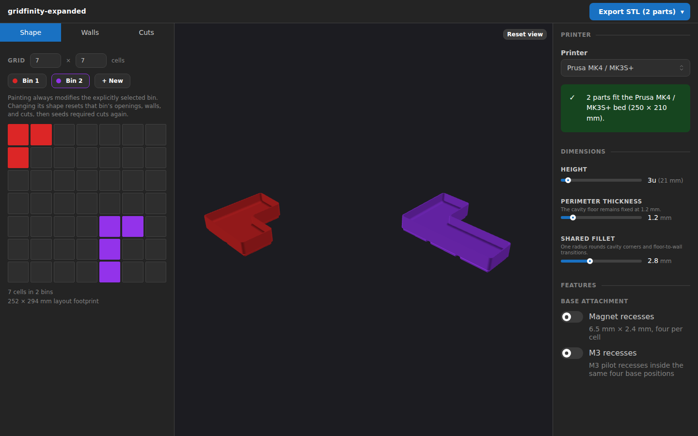

# Babylon Viewer

The normative preview/export relationship and coordinate rules live in [`geometry-pipeline.md`](./geometry-pipeline.md). This document records viewer-specific behavior.

## Input and meshes

`BabylonViewer` receives the same `Bin[]` that `ExportMenu` splits into printable objects, plus the validated design snapshot that produced it. `previewLayout()` in `src/lib/preview.ts` — the "modifications for better viewing" stage — flattens each bin's grouped pieces, mirrors its bin's cuts into the generated coordinate frame, and computes preview-only multipart gap offsets from those cuts and each piece's echoed generation-coordinate footprint cells. Each flattened piece keeps the stable `binId` shared with the 2D editors, and materials and palette colors are keyed by that id, so the 3D preview always matches the editor color for the same bin even after deletions cause ids and array positions to diverge.

There is no preview STL, loader, vertex welding, smoothing, or vertex splitting. The viewer creates sequential indices for the soup, computes normals, and applies `VertexData` directly. Since every triangle owns three vertices, its normal remains independent and the preview is flat-faceted. Manifold emits outward counter-clockwise winding, so the shared Babylon materials explicitly use counter-clockwise face orientation in the right-handed scene; back-face culling remains enabled and hides only the solid interior.

## Coordinates

`buildBinParameters()` mirrors the editor's row-down Y values across the complete design's occupied height before geometry generation; geometry uses those global coordinates with Z-up. The right-handed Babylon scene rotates the shared root by `-Math.PI / 2` to display Z-up data in Y-up space. It does not transform the mesh again for orientation. The default camera uses an alpha of `3π / 4`, a 180-degree orbit from the pre-mirror view, so the generated layout immediately faces the same direction as the editor.

Meshes stay at their generated coordinates. Only the `previewLayout()` offset is applied as a mesh transform, creating the 0.3 mm multipart gap without changing exported triangles.

## Lifecycle and camera

The engine, scene, root, camera, and lights are created once. A `ResizeObserver` keeps the canvas matched to the resizable side panels. New bin arrays dispose old meshes and materials, construct replacements, and refit the camera while preserving the user's orbit. “Reset view” restores the editor-matching `3π / 4` orbit.

The generic worker failure message overlays the canvas while the last successful parts remain available. Viewer code does not classify geometry or input errors.
