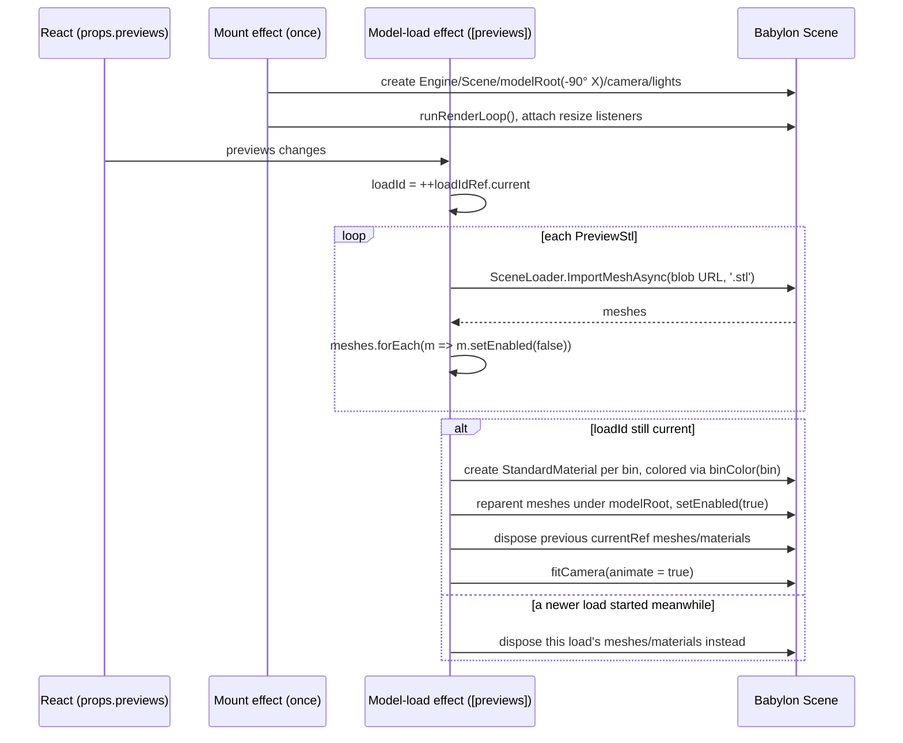
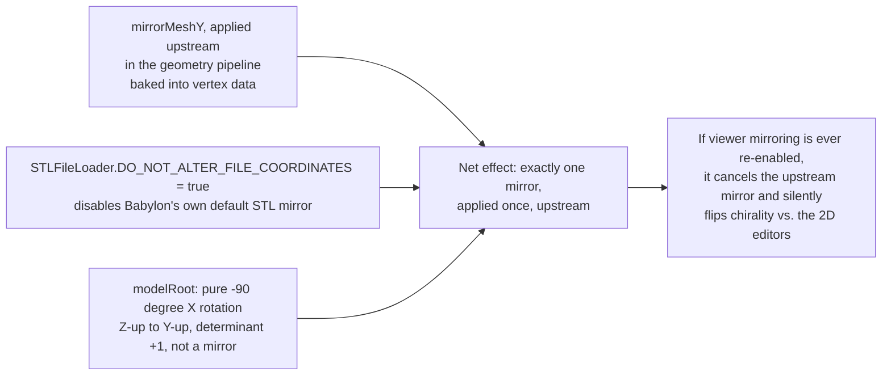

# Babylon.js Viewer

## Overview

`src/components/viewer/BabylonViewer.tsx` renders the 3D preview panel. It receives `previews: PreviewStl[]` — one binary-STL `ArrayBuffer` per logical bin, produced by the geometry pipeline (see [`docs/geometry-pipeline.md`](./geometry-pipeline.md)) — and an `error: string | null`. It owns a persistent Babylon `Engine`/`Scene` for the component's lifetime, and reloads only the model meshes when `previews` changes, so orbit/zoom state and lighting are never disturbed by a config edit.

## Component Boundary

`BabylonViewer.tsx` is the **only** file in the codebase that imports `@babylonjs/*`. Everything Babylon-specific — scene setup, camera fitting, material assignment, STL loading — lives inline in this one component; there are no separate camera-helper or materials-setup modules. It pulls in exactly two things from outside Babylon: `binColor()` from `src/components/sidebar/binColors.ts` (the same 8-color palette the 2D SVG editors use, so preview colors match the editor) and the `PreviewStl` type from `src/hooks/useBinGeometry.ts`.

In the component tree (`src/App.tsx`), `BabylonViewer` lives in `AppShell.Main`, a sibling of the `Sidebar` (shape/walls/split editors, in `AppShell.Navbar`) and `SettingsPanel` (printer/dimensions/features, in `AppShell.Aside`). `App` is the only caller of `useBinGeometry(config)`; it hands `previews`+`error` to `BabylonViewer` and `pieces` to `ExportMenu` — the viewer never sees export data.

## Mount Effect (Scene Setup, Runs Once)

A `useEffect` with an empty dependency array creates every Babylon object exactly once, all held in refs (not React state) so re-renders never rebuild the scene:

1. `Engine(canvas, true, { preserveDrawingBuffer: true, stencil: true })`, then a `Scene(engine)`.
2. A `TransformNode('modelRoot', scene)` rotated `-90°` on X — this is the *only* orientation transform the viewer applies (see the mirroring section below).
3. An `ArcRotateCamera` with orbit controls attached to the canvas.
4. One `HemisphericLight` (ambient, high `groundColor` so the undersides of connector pegs are lit) plus two `DirectionalLight`s (a key light and an under-fill light that specifically illuminates the peg profile from below).
5. `engine.runRenderLoop(...)`, and two resize listeners: a `window` `resize` listener, **and** a `ResizeObserver` on the canvas itself — the window listener alone misses resizes caused by dragging the sidebar, since that only changes the canvas's container size, not the window.
6. The effect's cleanup calls `engine.dispose()`, which cascades to dispose the scene, camera, lights, and any remaining meshes/materials.

### Coordinate system: right-handed, Z-up to Y-up rotation

`scene.useRightHandedSystem = true` — matching the STL file's own coordinate convention — plus the `modelRoot`'s rigid `-90°` X rotation (a pure rotation, determinant `+1`) is enough to reorient the STL's Z-up frame into Babylon's Y-up frame *without introducing any mirroring*. See [The Mirroring Invariant, Viewer Side](#the-mirroring-invariant-viewer-side) for why that distinction matters.

### Camera, lighting, resize handling

Covered above; camera framing itself is handled by `fitCamera()`, described under [Camera Fitting](#camera-fitting).

## Model-Load Effect (Runs on previews change)



### Loading STL via blob URL and SceneLoader.ImportMeshAsync

For each `PreviewStl`, the effect wraps its `ArrayBuffer` in a `Blob`/object URL and loads it with Babylon's registered `STLFileLoader` via `SceneLoader.ImportMeshAsync('', url, '', scene, null, '.stl')`, revoking the object URL once loading settles. **No manual `VertexData` construction happens anywhere** — the raw triangle buffers from the geometry pipeline always round-trip through a real binary STL `ArrayBuffer` (written by `meshToStl()` in the worker) before Babylon ever sees them. Newly loaded meshes are immediately hidden (`setEnabled(false)`) and stay hidden until the *entire* batch of previews for this load has resolved, so a multi-bin layout never flashes a partially-loaded state.

### Stale-load race guard (loadIdRef)

`loadIdRef` is a monotonic counter. Each model-load effect run captures `loadId = ++loadIdRef.current` before starting its (async) loads. When the batch resolves, if `loadId !== loadIdRef.current`, a newer `previews` change started and finished loading first — this load's meshes/materials are disposed immediately instead of being shown, and the previous swap already handled the display. Otherwise, this load's meshes become the new `currentRef`, the *old* `currentRef` meshes/materials are disposed, and the camera re-frames.

### Per-bin materials via binColor()

Meshes are grouped by the `bin` id each `PreviewStl` carries. One `StandardMaterial` is created per bin (not per mesh), colored via `Color3.FromHexString(binColor(bin))` and assigned to every mesh belonging to that bin — matching the same 8-color cycling palette the 2D shape/walls/split editors use, so a bin's color is consistent between the flat editor and the 3D view. STL has no color channel, so this coloring exists purely for the viewer and is never written to any exported file.

## The Mirroring Invariant, Viewer Side



At module scope, before any component renders:

```ts
STLFileLoader.DO_NOT_ALTER_FILE_COORDINATES = true;
```

Babylon's STL loader normally applies its own default coordinate correction, which is itself a reflection (determinant `-1`). The geometry pipeline already mirrors every output mesh once, at the source, via `mirrorMeshY` (see [`docs/geometry-pipeline.md#the-y-mirror-invariant`](./geometry-pipeline.md#the-y-mirror-invariant)) — specifically so the canvas, the preview, and the printed part all agree. If the viewer's loader *also* mirrored on import, the two mirrors would cancel out, and the 3D view would silently regress to showing the chiral mirror of what the 2D editors draw — a subtle, hard-to-notice bug rather than a crash. Setting `DO_NOT_ALTER_FILE_COORDINATES = true`, combined with `scene.useRightHandedSystem = true` (matching the STL's own handedness) and the `modelRoot`'s pure rotation, guarantees the viewer applies *no* mirroring at all — the single mirror already baked into the geometry is the only one that ever exists. This is the concrete mechanism behind `AGENTS.md`'s rule: "Do not compensate for orientation in the viewer."

### DO_NOT_ALTER_FILE_COORDINATES and why it must stay true

If this repo ever changes STL loaders, or a future refactor touches this flag, re-verify against the mirroring section above — flipping it back to Babylon's default would reintroduce the loader's own reflection and cancel the upstream mirror.

## Camera Fitting

`fitCamera(animate, resetAngles = false)` computes a world-space bounding box across every currently-visible mesh (`computeWorldMatrix` + `getBoundingInfo().boundingBox`, folded via `Vector3.Minimize`/`Maximize`), derives a fit radius from the camera's vertical/horizontal FOV plus a `FIT_MARGIN = 1.08` headroom factor, and either snaps the camera directly (`animate = false`, used on the very first load) or glides there over `ANIM_FRAMES = 36` frames (`Animation.CreateAndStartAnimation` per property, with a `CubicEase`/ease-in-out). The camera's orbit angle (`alpha`) is normalized modulo 2π against the default before any reset, so repeatedly resetting the view never spins the camera back through accumulated full turns. `resetAngles = true` is used only by the "Reset view" button; a routine model swap keeps the user's current orbit angle and only re-frames the target/radius.

## Related: Preview vs. Export Divergence

The viewer only ever sees `previews[]` — grouped per logical bin, kept in whole-layout coordinates, with a cosmetic per-piece seam inset. It never sees `pieces[]` (the print-ready, piece-local-coordinate STL files `ExportMenu` downloads). See [`docs/geometry-pipeline.md#preview-vs-export-divergence`](./geometry-pipeline.md#preview-vs-export-divergence) for the full comparison.
