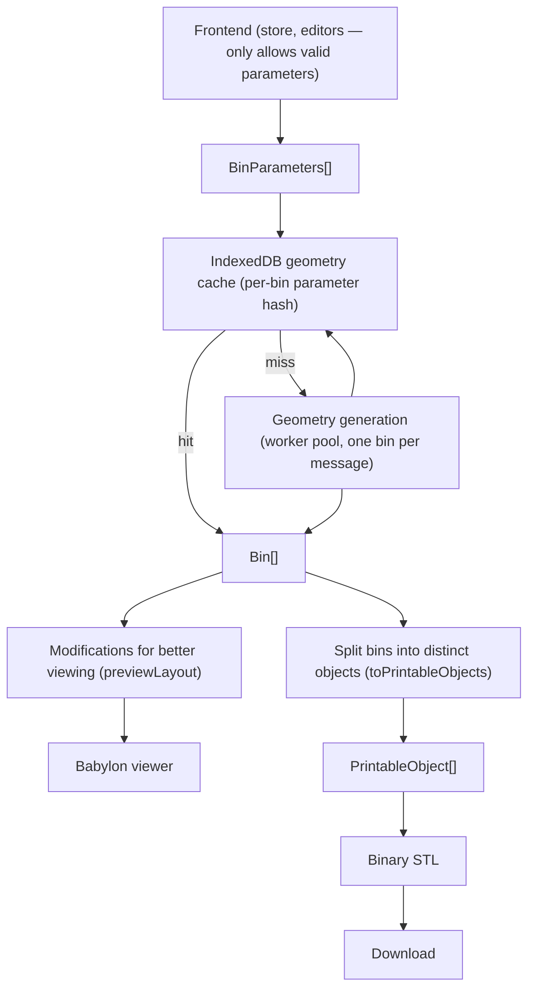

# Gridfinity Geometry Pipeline

This is the canonical specification and architecture record for the alpha generator. The UI supplies complete, valid, generation-ready input; invalid geometry-domain input has undefined behavior.

## Pipeline and ownership



The store owns bins, cuts, printer selection, and all editing behavior. The UI is responsible for only allowing valid parameters — controls constrain their own ranges and dependent values (the height slider re-clamps the shared fillet when it lowers the ceiling), and starting a paint gesture outside the selected bin's edge-connected footprint automatically starts and selects a new logical bin. That bin remains the gesture's target until the pointer is released. There is no geometry-facing clamping or validation layer between the UI and geometry generation, and enforcement of UI validity is best-effort during the alpha. `buildBinParameters()` converts the design into self-contained per-bin parameters, converting height units to millimetres, partitioning cells into piece footprints using the stored cuts, and mirroring every spatial value across the complete design's shared occupied Y extent. Geometry owns only solid construction and piece-footprint intersection; it trusts its input completely.

Downstream of generation, `Bin[]` fans out to two branches. The viewer branch (`previewLayout()` in `src/lib/preview.ts`) flattens pieces and attaches the multipart preview gap offsets. The export branch (`toPrintableObjects()` in `src/lib/export/printableObjects.ts`) splits each bin's grouped pieces into distinct, fully named printable objects for STL serialization.

The worker contract is:

```ts
interface BinParameters {
  binId: string;
  height: number;               // mm, already converted from height units
  perimeterThickness: number;
  filletRadius: number;         // already validated by the frontend
  fasteners: FastenerSettings;
  cells: Cell[];                // mirrored generation coordinates
  openings: Edge[];             // mirrored generation coordinates
  walls: Wall[];                // mirrored generation coordinates
  pieces: Cell[][];             // mirrored footprints; editor-derived array order defines piece index
}

interface BinPiece {
  triangles: Float32Array;      // global-coordinate flat triangle soup
  cells: Cell[];                // generation-coordinate footprint echoed for viewer-side layout
}

interface Bin {
  binId: string;
  pieces: BinPiece[];
}
```

Array order supplies each bin's piece index. Each bin carries its stable store id so preview colors and export filenames follow the same bin identity as the 2D editors, even after bins are deleted and ids are reused. Cache keys exclude that identity: a hit reapplies the requesting bin's current id while preserving the cached piece order, cells, and triangle arrays. Geometry receives no cuts, printers, filenames, or presentation transforms, and emits no preview data beyond each piece's echoed footprint cells.

## Gridfinity specification

`src/lib/gridfinitySpec.ts` separates compatibility dimensions from product defaults and implementation allowances. The generated profile uses a 42 mm pitch, 7 mm height units, 41.5 mm outer top width, 3.75 mm outer radius, 4.75 mm base profile, 7 mm complete base, and 1.2 mm fixed floor. Optional recesses are 6.5 × 2.4 mm for magnets and 3 × 6 mm for M3 hardware.

References are the community [Gridfinity specification](https://gridfinity.xyz/specification/), [Gridfinity Rebuilt OpenSCAD](https://github.com/kennetek/gridfinity-rebuilt-openscad), and [Gridfinity Documentation — Original Spec](https://stu142.com/Gridfinity-Documentation/).

## Valid-input assumptions

Each supplied bin is expected to be connected and all cells, openings, walls, radii, and piece groups are valid. The Shape editor checks edge connectivity when a paint gesture begins: a pointer-down cell sharing a horizontal or vertical edge extends the selected bin, while any other pointer-down cell starts a new selected bin. All cells painted before that pointer is released remain assigned to the gesture's initial target bin. Enclosed holes, irregular shapes, U shapes, and rings are supported. Geometry does not clamp values, find components, repair invalid profiles, create fallback cavities, or reinterpret piece groups. It also does not verify that its output is manifold; it trusts that valid input produces manifold output, and `npm run check:manifold` is the gate that verifies it.

The fillet slider derives its maximum from `maximumFilletRadius(height)` (cavity depth minus `IMPLEMENTATION_ALLOWANCES.minimumStraightCavityWall`), and the height slider writes the clamped fillet back when lowering the ceiling, so normal UI interaction cannot request a fillet deeper than the cavity. Nothing re-validates behind the UI.

Openings are canonical unit grid edges. Walls are straight millimetre segments with a width. Pieces are exact cell groups already derived by UI cut planning. Separate bins always create separate complete bins, even where cells touch.

## Solid construction

`generateGeometry()` creates one canonical Gridfinity base and translates it to every cell. Each bin's unioned cell footprint is constructed once and reused to derive both the outer body and cavity, avoiding duplicate 2D unions without changing either contour. It unions the translated bases with the complete outer-footprint extrusion. Positive outer contours use the fixed 3.75 mm Gridfinity radius for both convex corners and localized closing of re-entrant perimeter corners, so non-rectangular exterior wall junctions follow the same rounded profile without changing enclosed-hole contours or filling larger cutouts.

The cavity begins as the cell footprint inset by clearance and perimeter thickness. Opening channels are unioned into that footprint and supplied wall footprints are subtracted from it. For a positive shared fillet, each connected cavity region is independently expanded and inset by the fillet radius with rounded offsets. Additions from this 2D closing are restricted to a radius-sized envelope around the original re-entrant vertices, so 270-degree cavity corners round without joining wall-separated regions or consuming narrow free-form walls. The combined footprint is then eroded by the same radius, extruded exactly from the fillet's tangent height through the open top, and Minkowski-summed once with a sphere; only the lower hemisphere intersects the bin, producing rounded wall junctions, the rounded floor transition, and straight upper cavity as one exact solid. Filleting has no tolerance-based simplification, seed-thickness padding, or re-anchoring — those coarse approximations produced visible terraces on non-rectangular footprints. A zero-radius cavity is a straight extrusion.

The complete cavity is subtracted once. Canonical magnet and M3 cutters are translated to each cell and subtracted. A single-piece bin is emitted as built; a cut bin is intersected with each supplied piece footprint, using cutters that vertically overshoot the solid so no boolean faces coincide. The resulting pieces stay grouped under their bin in the returned `Bin[]`.

Each finished piece is simplified with a sub-micron epsilon to collapse boolean slivers, then extracted through one quantization boundary: `manifoldTriangles()` welds vertices on a 1-micron grid at serialized float32 precision, drops triangles the weld collapses, and rewrites the neighbors of any remaining exactly-degenerate facet so the soup stays closed and 2-manifold. Exact booleans can rebuild a feature twice within one float32 ULP, so a mesh that is valid in float64 can only be made watertight at the precision consumers receive by repairing after quantization. There is no output localization and no shape-level repair.

## Coordinates, preview, and export

`Design` remains in editor coordinates: X increases right and Y increases with rows down the screen. At the parameter boundary, `buildBinParameters()` mirrors the complete design across its maximum occupied row, using row zero as the finite extent when the design has no occupied cells. If `maxRow` is the largest cell Y in any bin, cells and vertical edges use `y′ = maxRow − y`; horizontal edges and grid-line points use `y′ = maxRow + 1 − y`; and millimetre wall points use `y′ = (maxRow + 1) × 42 − y`. Piece groups are partitioned before mirroring, so their array indexes and export filenames keep their editor-derived identity even though their echoed `BinPiece.cells` use generation coordinates.

Geometry and STL preserve these global generation coordinates with Z increasing upward. Origin placement is not changed per piece, and the preview and export branches consume the identical triangle soup.

Preview offsets are a viewer-branch concern: `previewLayout()` mirrors the paired design snapshot's cuts into generation coordinates, then computes each piece's 0.3 mm multipart gap offset from those cuts and the piece's echoed footprint cells. The viewer applies only that offset and the Z-up display rotation to meshes. Its default and reset camera orbit views the mirrored generation data from `3π / 4`, presenting it in the same facing direction as the row-down editor. Sequential preview indices give each triangle an independent normal without smoothing or vertex splitting.

`toPrintableObjects()` splits each bin's grouped pieces into distinct printable objects, deriving names from the bin's stable id and piece index. STL serialization writes each object's triangle soup directly and calculates one normal per triangle; preview offsets never affect printable coordinates.

The hook derives `BinParameters[]`, debounces changes, and increments a revision before asynchronously checking the per-bin IndexedDB cache. Cache keys are SHA-256 hashes over an explicit cache-version salt and every worker-consumed parameter except `binId`; editor identity and printer metadata therefore do not create duplicate meshes. Complete hits bypass worker messages. Partial hits post only missing bins, one single-bin message round-robin across a small worker pool (sized from `navigator.hardwareConcurrency`, capped at 4), then merge cached and generated bins back into design order. Successful worker results are persisted without delaying rendering.

Cache records contain structured-cloned per-piece `Float32Array` triangle soups and footprint cells, not STL bytes or preview transforms. Reads validate the record shape and return hits independently of a best-effort access-time refresh. Writes trigger cursor-based least-recently-used eviction when the approximate stored mesh size exceeds 100 MB, scanning one record at a time rather than materializing the full cache. Failed database opens are retried on later operations. Hashing, IndexedDB, corruption, and quota errors are all treated as cache misses or ignored writes; only worker-generation failures become the hook's generic geometry error. Revision checks discard stale cache lookups and worker replies, and each completed `Bin[]` remains paired with the design snapshot that produced it.

## Printability gates

`npm run check:manifold` exercises valid rectangular, irregular, U, ring/hole, opening, concave-perimeter, T- and cross-wall-junction, hardware, multiple-bin, multipart, and minimum-height/maximum-fillet fixtures through the production `buildBinParameters → generateGeometry` path. It reconstructs topology from triangle coordinates and requires non-empty pieces, watertight edges, consistent winding, no degenerates, duplicate faces, membranes, serialized-STL topology errors, or near-horizontal faces (by face normal) inside the fillet transition band — the terrace signature. Full-height wall fixtures must also retain interior top faces, guarding against a closing operation consuming narrow walls. The gate also asserts the mirrored parameter-boundary orientation and the 0.3 mm multipart gap through the viewer-branch `previewLayout()`.

Unit tests own cut-to-piece derivation, preview layout, and printable-object naming. Browser tests cover editor-matching orientation, flat-faceted preview, orbit/reset, multipart gaps, STL export, cache reuse across parameter reverts and reloads, partial cache hits, transient cache recovery, best-effort LRU refresh, LRU eviction, and the IndexedDB-unavailable fallback.
