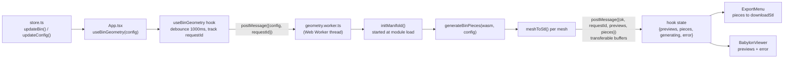
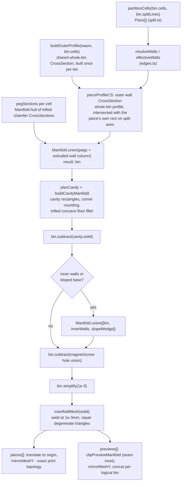
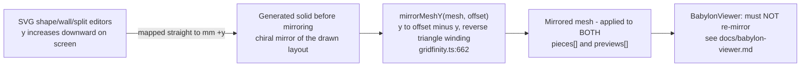

# Geometry Generation Pipeline

## Overview

Every visible bin — in the 3D preview and in the downloaded STL — comes from the same source: a `BinConfig` object in the Zustand store, run through a `manifold-3d` (WASM) CSG pipeline on a background Web Worker. The pipeline produces two different views of the result from the *same* underlying solid: `previews[]`, grouped and lightly reshaped for the 3D viewer, and `pieces[]`, kept exact for printing. This document walks the whole path from a config edit to STL bytes, and calls out the invariants that keep the canvas, the viewer, and the printed part all showing the same thing.

## Data Flow: Store to STL Buffers



Two guards keep this responsive and correct under rapid edits:

- **Debounce.** `useBinGeometry` re-serializes `config` to a string (`configKey`) and only restarts a 1000 ms timer when that string changes — so a slider drag or a burst of keystrokes coalesces into a single worker request once the user pauses.
- **Stale-response discard.** Every request carries a monotonically incrementing `requestId`. If a newer request was issued before an older one's result arrives, the hook drops the stale message by comparing `requestId` against the ref. On a worker error, the hook keeps the *previous* `previews`/`pieces` untouched and only updates `error` — so a bad parameter combination shows an error banner without blanking the last good view.

## State Ownership: store.ts and updateBin()

`store.ts` owns the single `config: BinConfig` object plus the active `printer: PrinterProfile`. `BinConfig.bins` is a `LogicalBin[]`, and each `LogicalBin` carries its own `splitLines: SplitLine[]` — the grid lines that break it into printable pieces.

`updateBin(id, patch)` is the only sanctioned way to mutate a bin. It merges the patch, then calls `withEffectiveSplit()`, which recomputes `splitLines` from the bin's current cells and the active printer's bed size (`computeAutoSplitLines`) unless the bin is `isManual`, in which case the user's manual lines are kept but filtered to only those that still span the bin's cells. Writing directly into `config.bins` through `updateConfig` would skip this reconciliation, and `splitLines` would drift out of sync with the shape or the printer profile — pieces could silently stop fitting the bed. `withEffectiveSplit` also preserves object identity when nothing actually changed, so the debounced effect in `useBinGeometry` doesn't restart for no reason.

## The Worker Boundary: useBinGeometry.ts and geometry.worker.ts

### Debouncing and request/stale-response guarding

Covered above (Data Flow section) — see `src/hooks/useBinGeometry.ts:36-81`.

### Why WASM initializes at module load

`geometry.worker.ts` calls `initManifold(() => wasmUrl)` at the top level, not inside `onmessage`:

```ts
const manifoldReady = initManifold(() => wasmUrl);
```

The worker module itself is created once, in `useBinGeometry`'s mount effect, and reused for every subsequent config change — so the WASM cold-start cost (fetch + instantiate the `.wasm` binary) is paid once per app session, overlapped with whatever the user does before their first edit, rather than serially in front of every request. `onmessage` just `await`s the already-in-flight (or already-resolved) `manifoldReady` promise.

## Core Domain Model (types.ts, edges.ts, split.ts)

The shared contracts in `src/lib/types.ts`:

- `GridCell { x, y }` — one occupied grid cell.
- `GridEdge { x, y, orientation: 'h'|'v' }` — a canonical grid-line segment. A `'v'` edge at `(x,y)` is the vertical line at `x·GRID_PITCH`, separating cells `(x-1,y)` and `(x,y)`; an `'h'` edge is the same idea for rows.
- `SplitLine { axis: 'x'|'y', index }` — a cut at one grid line, used to break a bin into printable pieces.
- `InnerWall { x1, y1, x2, y2, width, height }` — a free-form wall segment in whole-bin mm coordinates (not grid-aligned); `height: null` means full cavity height.
- `LogicalBin { id, cells, isManual, splitLines, slope? }` — one complete bin. Separate `LogicalBin` entries are separate, unconnected bins.
- `BinConfig { bins, heightUnits, wallThickness, cavityCornerRadius, innerFilletRadius, magnetHoles, screwHoles, openEdges, dividerEdges, innerWalls }` — the whole geometry configuration and the exact payload sent to the worker.

### GridEdge and effectiveWalls() rule engine

`src/lib/edges.ts`'s `effectiveWalls(pieceCells, wholeBinCells, openEdges, dividerEdges)` turns the user's exception lists into a concrete wall plan for one piece (`EffectiveWalls { walled, open, dividers }`):

- A piece-perimeter edge that is also a perimeter edge of the *whole logical bin* defaults to **walled**, unless it's in `openEdges`.
- A piece-perimeter edge that was **internal** to the whole bin — i.e. it exists only because a split line cut through the bin — is a **seam**. Seams default to **open**, so split pieces glue back into one continuous cavity, unless the user placed a `dividerEdge` exactly there, in which case both adjacent pieces get a full wall.
- Internal edges (not on the piece's perimeter at all) that have a `dividerEdge` become thin interior **dividers**.
- Config entries that no longer border the current cell set are silently ignored — shrinking or reshaping a bin never requires migrating `openEdges`/`dividerEdges`.

`gridfinity.ts` calls this twice per piece: once for the piece's own cells (`walls`) and once for the whole bin (`wholeWalls`), because seam classification and concave-corner handling both need the full-bin cell set, not just the current piece's.

### partitionCells() and split-piece semantics

`src/lib/split.ts`'s `partitionCells(cells, splitLines)` buckets each cell into a `(col, row)` chunk by counting how many split-line indices per axis the cell's coordinate is at or past, then groups same-chunk cells into a `Piece`. With no split lines it short-circuits to a single piece holding every cell. `flattenBins(bins)` tags every cell with its owning bin id — used for the store's grid-size calculation, `printers.ts`'s auto-split search, and (here) computing the shared layout height used when mirroring previews.

## Building One Bin's Solid: generatePieceManifold()

`generatePieceManifold(wasm, config, cells, binCells, binOuterCS, walls, slope)` (`src/lib/geometry/gridfinity.ts:565-614`) builds one piece's solid. Both public entry points below funnel through it — once per bin for `generateBinManifold`, once per split piece for `generateBinPieces`.



Notable construction details:

- **Connector pegs** are built per cell as three lofted, chamfered `CrossSection`s (`Manifold.hull` between profiles) so the peg has the spec's bottom lead-in chamfer, straight mid-section, and top widening chamfer, flush at `z = PEG_HEIGHT = 4.75` — a coordinate chosen because it's exactly float32-representable, so the boolean fuses the interface instead of leaving a seam.
- **The outer wall** always uses the Gridfinity-spec profile (41.5 mm top width, `PEG_R_TOP = 3.75` mm corner radius) — `cavityCornerRadius` only affects the interior cavity, never the outer wall, so bins always stack and nest correctly regardless of user settings.
- **The cavity floor fillet** (`buildFloorFillet`) is built by lofting a sequence of intersected, offset `CrossSection`s at increasing radii, hulled between consecutive steps — this produces one continuous concave round at the floor-to-wall junction rather than a stack of visible terraces.
- **Interior additions** (free-form `innerWalls`, the sloped-base wedge from `buildSlopedBaseManifold`, which cuts a prism with `Manifold.trimByPlane`) are deliberately unioned with material overlap (`WALL_EMBED`, `CSG_EPSILON`) rather than flush contact, so the boolean fuses through real volume instead of leaving a coincident-face membrane.
- **The final `simplify(1e-3)`** removes exactly-collinear vertices that boolean triangulation leaves along flush junction lines — ten times finer than the `CSG_EPSILON` overlaps, so it only removes triangulation artifacts, never real surface detail.

## generateBinPieces() vs generateBinManifold()

`generateBinManifold(wasm, config)` ignores `splitLines` entirely: each `LogicalBin` becomes one `Manifold` solid, and if there are multiple bins they're unioned into a single mesh. It's used (a) as the empty-bins fallback inside `generateBinPieces`, and (b) as the target of `scripts/check-manifold.ts`'s printability sweep. **The worker never calls it directly.**

`generateBinPieces(wasm, config)` — the function the worker actually calls — is split-aware. For each `LogicalBin` it partitions cells into `Piece[]`, builds one shared whole-bin outer profile (so every split piece's seam lines up on the bin's own pitch grid instead of getting an independently rounded edge), and for each `Piece` produces the *same* underlying `Manifold` solid feeding two divergent outputs (see next section).

## Preview vs. Export Divergence

Both outputs are derived from the identical per-piece `Manifold` solid, but diverge before serialization:

| Aspect | `previews[]` (viewer) | `pieces[]` (export) |
|---|---|---|
| Grouping | One mesh per **logical bin** — all its split pieces concatenated (`concatMeshes`) | One mesh per **split piece** — an independent file |
| Coordinates | Whole-layout mm coordinates, shared across all bins so relative bin positions are correct in the 3D view | Piece-local — each piece is translated so its own bounding-box minimum sits at the origin, independent of layout position |
| Cosmetic seam gap | Yes — `PREVIEW_INSET = 0.15` mm per side via `clipPreviewManifold`, applied only on axes that actually have a split line, done by **clipping** (not scaling, which would distort rounded/concave corners) | No — exact, unmodified seam-face topology, so printed pieces glue flush |
| Color | Colored per bin by the viewer (`binColor()`) | None — plain STL has no color channel |
| Orientation | Mirrored in Y (see next section) | Also mirrored in Y — identical to previews, so the view always matches what prints |
| Naming | Tagged by `bin: number` (logical bin id) | Tagged by `name: string`, e.g. `gridfinity-bin.stl`, `gridfinity-bin-2-piece-1-of-3.stl` (`pieceName()`) |

Both pass through the same `manifoldMesh()`/`repairMesh()` weld-and-repair boundary and the same `meshToStl()` binary serializer — the divergence is entirely in which `Manifold` variant is fed in and what coordinate transform runs before serialization.

## The Y-Mirror Invariant



The 2D editors map screen-down to mm `+y`, while solids extrude upward in `+z`. Left uncorrected, a part built straight from those coordinates would be the chiral mirror of what's drawn. `mirrorMeshY(mesh, offset)` (`gridfinity.ts:662-672`) fixes this once, at the geometry boundary, for *every* output mesh — both `pieces[]` and `previews[]` — by reflecting `y → offset − y` and reversing each triangle's winding so normals stay outward. Because this happens once, upstream of both consumers, the canvas, the 3D preview, and the printed part always agree.

This is why `AGENTS.md` states: "Do not compensate for orientation in the viewer." If the viewer applied its own mirror on top of this, the two mirrors would cancel out and silently regress to showing the *wrong* (chiral) orientation relative to the 2D editors. See [`docs/babylon-viewer.md`](./babylon-viewer.md#the-mirroring-invariant-viewer-side) for how the viewer avoids doing exactly that.

## Mesh Repair and Validation

### manifoldMesh() / repairMesh() / repairDegenerateTris()

`src/lib/geometry/manifold.ts` sits at every point a `Manifold` is turned into plain arrays, or those arrays are rewritten by a coordinate transform (translate, mirror):

- `manifoldMesh(manifold)` extracts `{vertProperties, triVerts}` from a finished `Manifold` and runs `repairMesh()`.
- `repairMesh(mesh)` welds vertices onto a 1 µm (`OUT_WELD = 1e3`) grid — coarse enough to merge the sub-micron near-coincidences a robust boolean can leave where differently-faceted surfaces meet, fine enough to never merge genuinely distinct geometry — then drops any triangle collapsed by that welding, then calls `repairDegenerateTris`.
- `repairDegenerateTris(vp, tris)` handles a different failure mode: a triangle that's valid in the WASM engine's float64 mesh can become exactly zero-area once its vertices are truncated to `Float32Array`. Simply dropping such a triangle would open a hole, so instead the neighbor across its longest edge is split at the sliver's middle vertex, keeping every directed edge paired and the mesh closed.
- Every output mesh calls `repairMesh` again after any post-extraction coordinate rewrite (translate, mirror) — the doc comment on `manifoldMesh` notes repair must happen "at the same precision callers receive," since a rewrite can introduce new float32-quantization slivers that didn't exist in the original extraction.

### meshValidation.ts (known gap: not wired into the worker or check-manifold.ts)

`src/lib/geometry/meshValidation.ts`'s `indexedMeshValidationError(mesh)` is a lightweight, dependency-free structural check (finite coordinates, in-range indices, no repeated-vertex or zero-area triangles) whose own doc comment says it's meant to "protect the worker export boundary." As of this writing it has **no call site outside its own unit test** — it isn't invoked from `geometry.worker.ts` or from `scripts/check-manifold.ts`. Treat it as an available guard, not an active one, until it's wired in somewhere.

## STL Serialization (export/stl.ts)

`meshToStl(vertProperties, triVerts)` (`src/lib/export/stl.ts:24-52`) hand-writes binary STL: an 84-byte header (80 bytes free-form + a 4-byte triangle count) followed by 50 bytes per triangle (a computed face normal, three vertex positions, all little-endian float32, plus a 2-byte zero attribute count). It runs **inside the worker**, for every mesh in both `previews` and `pieces` — even preview meshes get STL-serialized, since the pipeline standardizes on binary STL as its one wire format between the worker and the main thread, and Babylon's STL loader is what turns those bytes back into a scene (see [`docs/babylon-viewer.md`](./babylon-viewer.md)). `downloadStl`/`downloadBuffer` are separate, browser-only helpers `ExportMenu` uses to trigger a file download; they don't run in the worker.

## Printability Gate: scripts/check-manifold.ts

`npm run check:manifold` runs `scripts/check-manifold.ts`, which imports `generateBinManifold`/`generateBinPieces` directly (bypassing the worker and the debounce/request machinery entirely) and sweeps a matrix of `BinConfig` fixtures. For each resulting mesh — and for the STL `meshToStl` produces from it — it asserts the triangle mesh is a closed, watertight 2-manifold: every edge shared by exactly two oppositely-wound triangles, no boundary edges, no non-manifold edges, no degenerate or duplicate faces. This is the project's printability gate; per `AGENTS.md`, it must pass for every change touching geometry, split-piece generation, STL serialization, walls, slopes, fasteners, worker generation, or geometry-consumed configuration.

## Key Constants Reference

| Constant | Value | Meaning |
|---|---|---|
| `GRID_PITCH` | 42 mm | Gridfinity cell pitch |
| `HEIGHT_PER_UNIT` | 7 mm | mm per height unit |
| `BASE_TOTAL_HEIGHT` | 7 mm | connector peg (4.75 mm) + bridge (2.25 mm) |
| `FLOOR_THICKNESS` | 1.2 mm | cavity floor thickness |
| `PEG_R_TOP` / `OUTER_R` | 3.75 mm | outer wall corner radius — always spec, independent of `cavityCornerRadius` |
| `CSG_EPSILON` | 0.01 mm | deliberate overlap so unioned solids fuse through real volume instead of leaving a flush, coincident-face membrane |
| `PREVIEW_INSET` | 0.15 mm | per-side cosmetic seam gap, preview only |
| `WALL_EMBED` | 0.5 mm | how far interior additions (inner walls, slope wedge) embed into existing material before unioning |
| `OUT_WELD` (manifold.ts) | 1e3 (1 µm grid) | vertex-welding precision in `repairMesh` |
