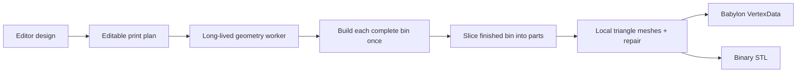

# Gridfinity Geometry Pipeline

This is the canonical specification and architecture record for the alpha generator. It defines the supported happy path from an editor design to previewed and exported triangle meshes. Rule changes must update this document and the relevant happy-path tests in the same change.

## Pipeline



There is one production output: `GeneratedPart[]`. Preview and export consume the same `Float32Array` positions and `Uint32Array` indices. Preview never serializes or loads STL, and export never regenerates geometry.

## Specification and sources

`src/lib/gridfinitySpec.ts` is dependency-free and separates three categories:

1. `GRIDFINITY_SPEC` contains compatibility dimensions.
2. `GRIDFINITY_DERIVED` contains measurements calculated from those dimensions.
3. `DESIGN_DEFAULTS` and `IMPLEMENTATION_ALLOWANCES` contain product choices, print-planning clearance, preview spacing, and small CSG/mesh tolerances. They are not Gridfinity requirements.

The implemented compatibility profile uses:

| Measurement | Value |
| --- | ---: |
| Grid pitch | 42 mm |
| Height unit and total-height formula | 7 mm; `units × 7 mm` |
| Minimum editor height | 2 units / 14 mm |
| Outer top width | 41.5 mm |
| Outer corner radius | 3.75 mm |
| Base profile height | 4.75 mm |
| Base bridge height | 2.25 mm, derived to make a 7 mm base |
| Floor thickness | 1.2 mm, fixed |
| Default perimeter thickness | 1.2 mm |
| Default shared fillet | 2.8 mm |
| Magnet hardware / generated recess | 6 × 2 mm / 6.5 × 2.4 mm |
| Screw recess | M3 diameter × 6 mm depth |

The top rim is flat. Perimeter thickness is configurable. One shared fillet radius controls planar cavity rounding and floor-to-wall transitions, including internal-wall bases. There are no grid dividers, variable wall heights, floor slopes, or separate cavity-radius setting.

Primary references:

- The community-maintained [Gridfinity specification](https://gridfinity.xyz/specification/) records the 42 mm grid, 7 mm height units, 6 × 2 mm magnets, and M3 corner screws.
- [Gridfinity Rebuilt OpenSCAD](https://github.com/kennetek/gridfinity-rebuilt-openscad) is the maintained parametric reference for the compatible base profile and derived measurements.
- [Gridfinity Documentation — Original Spec](https://stu142.com/Gridfinity-Documentation/) collects the original bin-profile and hardware-placement drawings.

These references are still evolving. The constants module is the exact, reviewable statement of what this application currently generates.

## Design contract and ownership

`Design` is a plain, structured-clone-safe value containing bins, shared dimensions, fastener settings, and printer settings. Each `BinDesign` owns its cells, perimeter openings, full-height internal walls, and exact cut segments. Separate bins always produce separate complete Gridfinity bins, even when their cells touch.

The Zustand store exposes explicit commands for shape painting, dimensions, fasteners, printers, openings, walls, and cuts. There is no generic configuration patch command. Painting always modifies the bin the user explicitly selected. A shape edit clears that changed bin's openings, walls, and cuts, then seeds cuts required by the current printer.

The future editor rule “painting disconnected from the selected bin starts and selects a new bin, even beside another bin” is intentionally deferred to [issue #58](https://github.com/ashton22305/gridfinity-expanded/issues/58).

## Alpha happy-path assumptions

The generator assumes every supplied bin is edge-connected and otherwise valid. Invalid-domain behavior, including disconnected cells within one bin, is intentionally undefined.

Do not add geometry-side component splitting, automatic bin creation, repair, rejection, fallback generation, or user-facing invalid-input categories. Do not add tests that define disconnected-bin behavior. Contiguity belongs in the editor when issue #58 is implemented.

Enclosed holes are valid. Examples below use `■` for a cell and `·` for empty space:

```text
Irregular       U-shaped        Ring-shaped
■■■             ■·■             ■■■
■■·             ■·■             ■·■
■··             ■■■             ■■■
```

All three are edge-connected. The ring's center is an enclosed perimeter, not a disconnected component.

## Openings and walls

An `Edge` is one canonical unit grid edge in editor row-down coordinates. An opening may lie on an outer perimeter or an enclosed-hole perimeter. If the same edge is a perimeter of two adjacent bins, editing it updates both bins so their coincident faces agree.

Internal `Wall` values are straight millimetre segments owned by one bin. Each has its own width and always reaches from the cavity floor to the flat top rim. Geometry clips wall footprints to the owning bin, embeds them slightly into the floor for a volume-overlap union, and applies the shared base fillet.

## Editable cuts and print planning

A `Cut` has exact integer-grid endpoints and follows shared cell edges. Cuts contain no automatic/manual mode and no derived global line state.

`partitionCells()` treats cells as a graph. Cardinal neighbors remain connected unless a cut covers their shared unit edge. This makes a ring cut naturally representable as two or more collinear segments separated by its hole.

Default cuts are created recursively:

1. Partition by existing cuts.
2. Find the first part that does not fit the printer in either 0° or 90° orientation, including the planning margin.
3. Choose the available grid line closest to an equal cell-count bisection.
4. Add every collinear segment needed to sever that current part at the chosen line.
5. Repeat until all parts fit or no candidate remains.

Users can add, remove, move, or reset the stored segments directly. The editor offers only internal shared-edge candidates; it is not a general polygon validator. Changing printers preserves a fitting user plan. If it no longer fits, the store keeps existing cuts and adds only the bisections required by the happy-path calculation.

## Geometry generation

`generateDesignParts()` is the only production generator. For each logical bin it:

1. Converts editor row-down coordinates to model `+Y` coordinates.
2. Builds every Gridfinity base profile and the complete outer body.
3. Plans openings and perimeter material, then subtracts one cavity whose corner and floor transitions share the configured fillet.
4. Unions all full-height internal walls with real overlap.
5. Subtracts magnet and/or M3 recesses.
6. Intersects the finished bin with each cut-planned part footprint, so seams slice the body, walls, fillets, and hardware consistently.
7. Calls `manifoldMesh()` on every sliced solid.
8. Translates each mesh into final local print coordinates and calls `repairMesh()` again at the final `Float32` precision.

The build uses native `manifold-3d` `CrossSection` and `Manifold` booleans. Individually closed primitives and small non-normative overlap prevent coincident-face membranes. There is no geometry-side connected-component normalization.

## Coordinates and orientation

The store keeps the editor's natural row-down coordinates. The geometry boundary performs the only handedness normalization:

- editor cell `(x, y)` becomes model cell `(x, -y - 1)`;
- editor grid point `(x, y)` becomes model point `(x, -y)`;
- edges, cuts, and wall endpoints follow the same mapping.

No mesh is mirrored later. A `GeneratedPart.mesh` is Z-up and part-local, with its minimum X, Y, and Z at zero. `layoutPosition` restores its model-space design position for preview. Babylon applies only a rigid `-90°` X rotation to display Z-up geometry in its Y-up scene.

## Preview and export

The worker initializes Manifold once, accepts `{ design, requestId }`, and transfers typed mesh buffers back with the same request ID. The hook keeps one worker alive, debounces edits, and ignores stale responses. Unexpected exceptions enter the generic generation-failure state; they are not interpreted as domain-validation results.

`BabylonViewer` constructs a Babylon `Mesh` and `VertexData` directly from every generated mesh. It uses `layoutPosition` plus the preview-only `previewOffset`. Each distinct cut line shifts parts by half of the 0.3 mm gap on opposite sides, so adjacent preview faces separate by 0.3 mm. The mesh arrays remain unchanged.

STL export computes facet normals and serializes those same unchanged part-local arrays. It does not apply layout positions or preview offsets. Multipart STL files therefore retain exact seam topology and individual part meaning.

## Printability and required tests

`manifoldMesh()` welds and repairs the extracted indexed mesh. `repairMesh()` must run again after final localization because `Float32` coordinate writes can create degenerate slivers that did not exist before the transform.

`npm run check:manifold` exercises the production function only. Its fixtures cover multiple valid bins, irregular/U/ring shapes, holes, outer and hole openings, shared fillets, full-height and crossing walls, both hardware recesses, recursive and ring cuts, post-build wall slicing, local coordinates, model orientation, preview offsets, and binary STL topology.

Happy-path unit tests cover specification values, `units × 7 mm`, coordinate normalization, selected-bin painting, holes and shared openings, editable cuts, recursive bisection, and printer rotation. Browser tests cover the visible 21 mm height, selected-bin painting, removed controls, cut editing/reset, direct typed-mesh preview, multipart transforms, and STL export.
