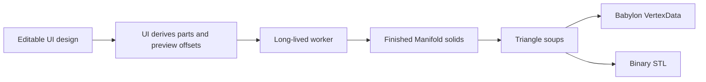

# Gridfinity Geometry Pipeline

This is the canonical specification and architecture record for the alpha generator. The UI supplies complete, valid, generation-ready input; invalid geometry-domain input has undefined behavior.

## Pipeline and ownership



The store owns bins, cuts, printer selection, and all editing behavior. `buildGeometryInput()` converts height units to millimetres, partitions cells using the stored cuts, and derives preview offsets. Export owns filenames. Geometry owns only solid construction and part-footprint intersection.

The worker contract is:

```ts
interface GeometryInput {
  height: number;
  perimeterThickness: number;
  filletRadius: number;
  fasteners: FastenerSettings;
  bins: GeometryBin[];
}

interface GeometryBin {
  cells: Cell[];
  openings: Edge[];
  walls: Wall[];
  parts: Cell[][];
  previewOffsets: Point2[];
}

interface GeneratedPart {
  binIndex: number;
  triangles: Float32Array;
  previewOffset: Point2;
}
```

Array order supplies each bin's part index. Geometry receives no cuts, printers, IDs, filenames, or presentation transforms.

## Gridfinity specification

`src/lib/gridfinitySpec.ts` separates compatibility dimensions from product defaults and implementation allowances. The generated profile uses a 42 mm pitch, 7 mm height units, 41.5 mm outer top width, 3.75 mm outer radius, 4.75 mm base profile, 7 mm complete base, and 1.2 mm fixed floor. Optional recesses are 6.5 × 2.4 mm for magnets and 3 × 6 mm for M3 hardware.

References are the community [Gridfinity specification](https://gridfinity.xyz/specification/), [Gridfinity Rebuilt OpenSCAD](https://github.com/kennetek/gridfinity-rebuilt-openscad), and [Gridfinity Documentation — Original Spec](https://stu142.com/Gridfinity-Documentation/).

## Valid-input assumptions

Each supplied bin is connected and all cells, openings, walls, radii, and part groups are valid. Enclosed holes, irregular shapes, U shapes, and rings are supported. Geometry does not clamp values, find components, repair invalid profiles, create fallback cavities, or reinterpret part groups.

Openings are canonical unit grid edges. Walls are straight millimetre segments with a width. Parts are exact cell groups already derived by UI cut planning. Separate bins always create separate complete bins, even where cells touch.

## Solid construction

`generateGeometry()` creates one canonical Gridfinity base and translates it to every cell. It unions those bases with the complete outer-footprint extrusion.

The cavity begins as the cell footprint inset by clearance and perimeter thickness. Opening channels are unioned into that footprint and supplied wall footprints are subtracted from it. For a positive shared fillet, the inset cavity seed is extruded through the open top and Minkowski-summed once with a sphere; only the lower hemisphere intersects the bin, producing the rounded floor transition and straight upper cavity as one solid. The construction seed thickness is also the native Manifold tolerance used to collapse Minkowski artifacts, and the result is re-anchored to the exact cavity-floor height. A zero-radius cavity is a straight extrusion.

The complete cavity is subtracted once. Canonical magnet and M3 cutters are translated to each cell and subtracted. Finally, the finished bin is intersected with each supplied part footprint.

Manifold's native indexed mesh is expanded directly into a `Float32Array` triangle soup. There is no output localization, vertex weld, mesh-validation layer, or degenerate-triangle rewrite.

## Coordinates, preview, and export

Editor coordinates are model coordinates: X increases right, Y increases with editor rows, and Z increases upward. Geometry and STL preserve those coordinates. Origin placement is not changed per part.

The viewer applies only the supplied multipart offset and the Z-up display rotation. Its camera is configured so the row-down design matches the editor. Sequential preview indices give each triangle an independent normal without smoothing or vertex splitting.

STL serialization writes the same triangle soup directly and calculates one normal per triangle. Export derives names from bin and part indices; preview offsets never affect printable coordinates.

The hook maintains one initialized worker, debounces changes, increments a revision, ignores stale replies, and reports one generic worker failure message. There is no serialized design key.

## Printability gates

`npm run check:manifold` exercises valid rectangular, irregular, U, ring/hole, opening, wall, hardware, multiple-bin, and multipart fixtures. It reconstructs topology from triangle coordinates and requires watertight edges, consistent winding, no degenerates, duplicate faces, membranes, serialized-STL topology errors, or horizontal faces inside the fillet transition.

Unit tests own cut-to-part derivation and export filename behavior. Browser tests cover editor-matching orientation, flat-faceted preview, orbit/reset, multipart gaps, and STL export.
