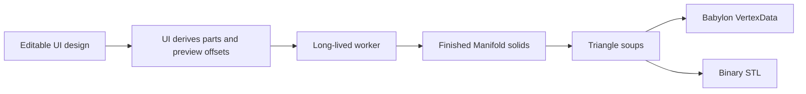

# Gridfinity Geometry Pipeline

This is the canonical specification and architecture record for the alpha generator. The UI supplies complete, valid, generation-ready input; invalid geometry-domain input has undefined behavior.

## Pipeline and ownership



The store owns bins, cuts, printer selection, and all editing behavior. `buildGeometryInput()` converts height units to millimetres, partitions cells using the stored cuts, and derives preview offsets. Export owns filenames. Geometry owns only solid construction and part-footprint intersection.

The worker contract is:

```ts
interface GeometryInput {
  height: number;
  perimeterThickness: number;
  filletRadius: number;
  fasteners: FastenerSettings;
  bins: GeometryBin[];
}

interface GeometryBin {
  id: string;
  cells: Cell[];
  openings: Edge[];
  walls: Wall[];
  parts: Cell[][];
  previewOffsets: Point2[];
}

interface GeneratedPart {
  binId: string;
  triangles: Float32Array;
  previewOffset: Point2;
}
```

Array order supplies each bin's part index. Each part carries its bin's stable store id so preview colors and export filenames follow the same bin identity as the 2D editors, even after bins are deleted and ids are reused. Geometry receives no cuts, printers, filenames, or presentation transforms.

## Gridfinity specification

`src/lib/gridfinitySpec.ts` separates compatibility dimensions from product defaults and implementation allowances. The generated profile uses a 42 mm pitch, 7 mm height units, 41.5 mm outer top width, 3.75 mm outer radius, 4.75 mm base profile, 7 mm complete base, and 1.2 mm fixed floor. Optional recesses are 6.5 × 2.4 mm for magnets and 3 × 6 mm for M3 hardware.

References are the community [Gridfinity specification](https://gridfinity.xyz/specification/), [Gridfinity Rebuilt OpenSCAD](https://github.com/kennetek/gridfinity-rebuilt-openscad), and [Gridfinity Documentation — Original Spec](https://stu142.com/Gridfinity-Documentation/).

## Valid-input assumptions

Each supplied bin is connected and all cells, openings, walls, radii, and part groups are valid. Enclosed holes, irregular shapes, U shapes, and rings are supported. Geometry does not clamp values, find components, repair invalid profiles, create fallback cavities, or reinterpret part groups.

`buildGeometryInput()` guarantees a valid fillet radius: it clamps the design's shared fillet to the cavity depth minus `IMPLEMENTATION_ALLOWANCES.minimumStraightCavityWall`, via `maximumFilletRadius(height)`. The fillet slider derives its maximum from the same helper, so no UI state can request a fillet deeper than the cavity.

Openings are canonical unit grid edges. Walls are straight millimetre segments with a width. Parts are exact cell groups already derived by UI cut planning. Separate bins always create separate complete bins, even where cells touch.

## Solid construction

`generateGeometry()` creates one canonical Gridfinity base and translates it to every cell. It unions those bases with the complete outer-footprint extrusion.

The cavity begins as the cell footprint inset by clearance and perimeter thickness. Opening channels are unioned into that footprint and supplied wall footprints are subtracted from it. For a positive shared fillet, the footprint eroded by the fillet radius is extruded exactly from the fillet's tangent height through the open top and Minkowski-summed once with a sphere; only the lower hemisphere intersects the bin, producing the rounded floor transition and straight upper cavity as one exact solid. Filleting has no tolerance-based simplification, seed-thickness padding, or re-anchoring — those coarse approximations produced visible terraces on non-rectangular footprints. A zero-radius cavity is a straight extrusion.

The complete cavity is subtracted once. Canonical magnet and M3 cutters are translated to each cell and subtracted. A single-part bin is emitted as built; a cut bin is intersected with each supplied part footprint, using cutters that vertically overshoot the solid so no boolean faces coincide.

Each finished part is simplified with a sub-micron epsilon to collapse boolean slivers, then extracted through one quantization boundary: `manifoldTriangles()` welds vertices on a 1-micron grid at serialized float32 precision, drops triangles the weld collapses, and rewrites the neighbors of any remaining exactly-degenerate facet so the soup stays closed and 2-manifold. Exact booleans can rebuild a feature twice within one float32 ULP, so a mesh that is valid in float64 can only be made watertight at the precision consumers receive by repairing after quantization. There is no output localization and no shape-level repair.

## Coordinates, preview, and export

Editor coordinates are model coordinates: X increases right, Y increases with editor rows, and Z increases upward. Geometry and STL preserve those coordinates. Origin placement is not changed per part.

The viewer applies only the supplied multipart offset and the Z-up display rotation. Its camera is configured so the row-down design matches the editor. Sequential preview indices give each triangle an independent normal without smoothing or vertex splitting.

STL serialization writes the same triangle soup directly and calculates one normal per triangle. Export derives names from the part's stable bin id and part index; preview offsets never affect printable coordinates.

The hook maintains one initialized worker, debounces changes, increments a revision, ignores stale replies, and reports one generic worker failure message. There is no serialized design key.

## Printability gates

`npm run check:manifold` exercises valid rectangular, irregular, U, ring/hole, opening, wall, hardware, multiple-bin, multipart, and minimum-height/maximum-fillet fixtures. It reconstructs topology from triangle coordinates and requires non-empty parts, watertight edges, consistent winding, no degenerates, duplicate faces, membranes, serialized-STL topology errors, or near-horizontal faces (by face normal) inside the fillet transition band — the terrace signature.

Unit tests own cut-to-part derivation and export filename behavior. Browser tests cover editor-matching orientation, flat-faceted preview, orbit/reset, multipart gaps, and STL export.
